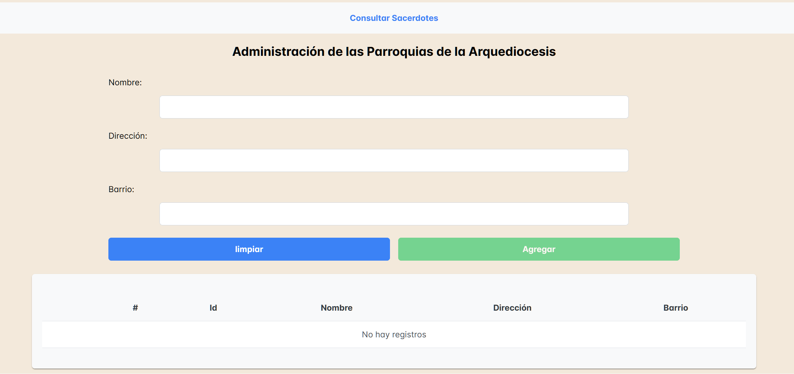

# Proyecto en Angular V.16 CLI
# Temática: Administración de Usuarios
## Estado del Proyecto: En Desarrollo.

Este repositorio contiene un proyecto práctico sobre Angular V.16, que permite efectuar acciones de tipo `CRUD`
sobre la información a manipular, el cual se divide en 3 ramas `main`, `develop` y `deploy-neflify`.

Nota: el proyecto soporta multilenguaje(I18N) en los idiomas de español e inglés.

[//]: <> (Adicionalmente el proyecto cuenta con 2 ambientes, el de `Producción` y `Desarrollo`.)

## Estructura del Proyecto

La estructura del proyecto se diseño teniendo en consideración las mejores prácticas de organización de un proyecto Angular, quedando su estructura de la siguiente manera:

* src
    * app
        * core
            * guards
            * interfaces
            * services
        * features
        * shared
    * assets
    * environments

## Tecnologías Utilizadas

Se utilizan las siguientes herramientas:
* HTML
* CSS
* JavaScript
* TypeScript
* Angular V.16
* PrimeNG V.16.9.1
* PrimeFlex V.3.3.1
* PrimeIcons V.7.0.0
* NgxTranslateCore V.15.0.0
* NgxTranslateHttpLoader V.8.0.0

## Ramas

### `main`

La rama `main` se utiliza solo para proporcionar información básica del repositorio,
en este caso el archivo `README`.

### `develop`

En la rama `develop` encontrarás el proyecto de Angular, el cual gestiona usurios religiosos y parroquias de la Arquediocesis. Incluye funcionalidades como la consulta, creación, edición y eliminación de parroquias y sacerdotes entre otras, persistiendo la información en una base de datos sql.

Cabe mencionar que el proyecto ya tiene configurado 2 ambientes, correspondientes a `environment.ts`(si se despliega a producción tomaría este archivo) y `environment.development.ts`(al desplegarlo en modo desarrollo toma este archivo).
En estos archivos se encuentran las configuraciones necesarias para su funcionamiento.

### `deploy-neflify`

En la rama `deploy-neflify` encontrarás el proyecto de Angular estable y listo para llevar a producción.

## Instrucciones de Ejecución

### Rama Develop

Para poner en ejecución el proyecto de las presentes ramas se requieren los siguientes items:
* Git instalado para clonar el repositorio remoto en la máquina local.
* NodeJS instalado, para descargar las dependencias que utilice el proyecto definidas en el archivo package.json.

### Pasos para Poner en Ejecución la Aplicación

Ejecutar los siguientes comandos:
1. `git clone https://github.com/JuanCamiloDevFrontBack/angular-archdiocese-management.git`.
2. `npm i` ó `npm install`.
4. Levantar la aplicación con: `npm run start-dev`.
5. Abrir en el navegador la siguiente url: `http://localhost:5000/` ó `http://localhost:5000/parished`.

### Rama Deploy-Neflify

Para poner en ejecución el proyecto de la presente rama se requieren los siguientes items:
* Abrir el navegador web de su preferencia e ingresar al siguiente enlace web: `https://deploy-neflify--kaleidoscopic-donut-c00ef3.netlify.app/parished`.
